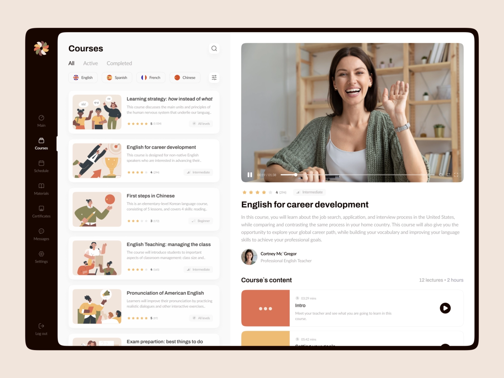

# Technical-Interview
 

## Bienvenido al challenge Tecnico de Henry!

Tenemos una Edtech que está en pleno crecimiento y busca brindar el mejor servicio para sus alumnos. Para esto, nuestro equipo de UX/UI en conjunto con Producto desarrolló este diseño.
Buscamos llevar a cabo esta nueva funcionalidad y es acá donde vos podes ayudarnos a llegar a nuestro destino. 

 

## **Dashboard**

# 
## Backend
- Definir los endpoints necesarios para el correspondiente funcionamiento de la aplicación.
- Respetar el estándar REST.
- Establecer un contrato (JSON) para que el equipo de frontenders pueda consumir esta funcionalidad.
- Realizar los test unitarios que garanticen el correcto funcionamiento.
- Dejar documentado en Swagger la funcionalidad.

## Frontend
- Implementar el diseño respetando las buenas prácticas. 
- Realizar los test unitarios que garanticen el correcto funcionamiento.
- Proponer un contrato de negocio (JSON) para poder trabajar con tu equipo de backenders.

### Constraints
- Github privado [Gitflow]
- Styled components
- Typescript
- NodeJS LTS
- Express / NestJs / Sequelize / Type ORM
- ReactJs / NextJS
- Jest / Testing library / Enzyme / Cypress 
- Readme (Por favor anota todos los concern que tuviste durante el desarrollo y que decisión tomaste al respecto.)

### Nice to Have
- Patrones de diseño
- Componentización
- CI/CD
- Diagrama de arquitectura
- Diagrama de componentes
- Docker
- Swagger
- AWS [Cloudwatch - Lambda - RDS - Elasticbeanstalk]
- Tener conocimiento de  metodologías ágiles [SCRUM - KANBAN]
- Base de datos SQL - NoSql
- Auth0 - Cognito    